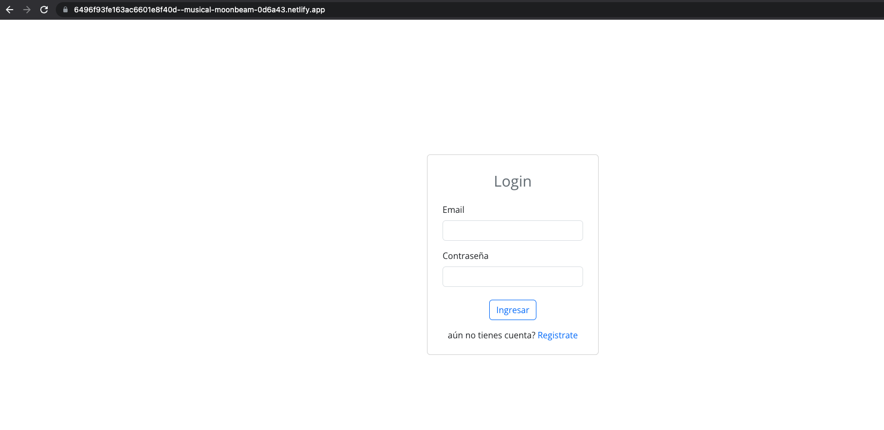
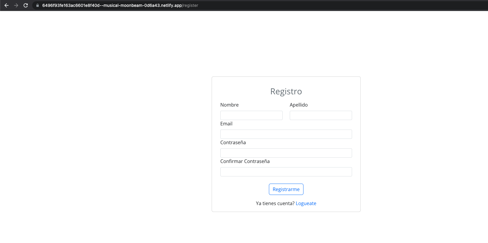
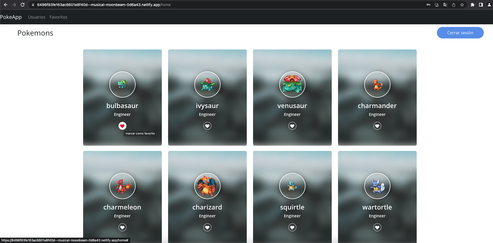
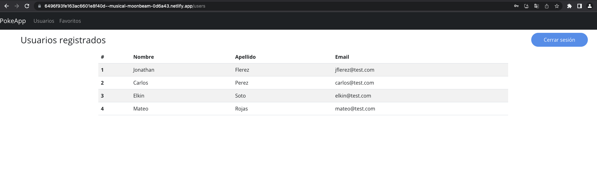
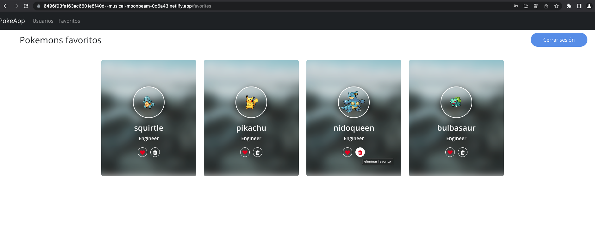

# Consideraciones para poner en marcha la aplicación en ambiente local

This project was bootstrapped with [Create React App](https://github.com/facebook/create-react-app).

## Ejecución de scripts

Es importante ejecutar los siguientes comandos en el mismo orden que se detallan a continuación:

### `npm install`

comando necesario para instalar todoas las dependencias del proyecto.

### `npm start`

Levanta la aplicación y la abre en el [http://localhost:3000](http://localhost:3000) del navegador.

## Acceder a la aplicación desplegada

Esta aplicación tambien se encuentra desplegada en netlify con el fin de interactuar con ella sin la necesidad de realizar las configuraciones mencionadas anteriormente, para ello accedemos desde el navegador a la siguiente url: [https://6496f93fe163ac6601e8f40d--musical-moonbeam-0d6a43.netlify.app/](https://6496f93fe163ac6601e8f40d--musical-moonbeam-0d6a43.netlify.app/)

Para ingresar hago uso de las siguientes credenciales:

email: elkin@test.com
constraseña: 12345678

Sin embargo, por medio de la sección de registro se pueden crear nuevos usuarios.

## Sección de login

## Sección de registro de nuevos usuarios

## Sección de listado de pokemons con opción de marcarlos como favoritos

## Sección de listado de usuarios

## Sección de listado de pokemons marcados como favoritos con opción de eliminarlos

